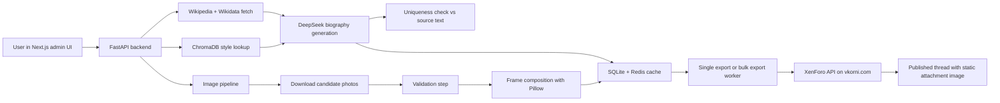

# Vkorni

AI-assisted biography generation, memorial image preparation, and publishing to `vkorni.com`.

Languages:
- English: `README.md`
- Russian: [README.ru.md](README.ru.md)
- Deployment guide: [README.dep](README.dep)

## Overview

Vkorni is a full-stack application that takes a person's name, pulls factual context from Wikipedia and Wikidata, generates a literary biography with DeepSeek, enriches the result with curated images, composes framed memorial portraits, and publishes the final post to `vkorni.com` through the XenForo API.

The app also supports batch generation and resilient bulk export. Generated texts are cached, image assets are stored locally, style prompts are retrieved from a small ChromaDB-backed RAG layer, and export jobs are processed through Redis + RQ workers.

## What The System Does

- Generates biographies from Wikipedia context.
- Uses a small ChromaDB-backed style RAG layer to retrieve writing-style examples.
- Checks generated text against source material to reduce Wikipedia-like duplication.
- Downloads candidate images, validates them, rejects weak ones, and prepares framed portraits.
- Publishes the final content to `vkorni.com` through the XenForo API.
- Supports bulk generation and self-healing bulk export with retries and resume logic.

## Visual Flow



## How It Works

### 1. Data collection

The backend resolves a person from Wikipedia and Wikidata, gathers summary facts, date information, and available images, and normalizes that data into a generation context.

### 2. Small style RAG

The application uses ChromaDB as a lightweight style-retrieval layer. When a style name is requested, the backend either fetches the exact stored style or falls back to the nearest style documents from ChromaDB and injects them into the prompt context.

### 3. Biography generation

DeepSeek receives:
- factual person context from Wikipedia
- the selected style context from ChromaDB
- an internal narrative angle template

It returns a literary biography which is then cleaned and checked for similarity against the source text.

### 4. Image processing

The image pipeline:
- downloads source photos
- validates them
- rejects unsuitable images
- composes memorial portraits with dates and styling
- stores accepted and rejected assets in separate directories

### 5. Publishing

Export to `vkorni.com` uploads a static attachment through XenForo first, then creates the thread. The image inserted into the post is the XenForo attachment URL, not a backend `/api` URL.

### 6. Bulk export

Bulk export now works per profile, not as one long fragile job. Each item has its own persisted status, retry counter, and resume path. Stalled items can be re-queued automatically by a watchdog worker.

## Main Components

| Layer | Technology |
|---|---|
| Frontend | Next.js 15, React 19, Tailwind CSS |
| Backend | FastAPI, Python 3.11 |
| Text generation | DeepSeek API |
| Queue | Redis + RQ |
| Style retrieval | ChromaDB |
| Relational storage | SQLite + SQLAlchemy |
| Image composition | Pillow |
| Packaging | Docker Compose |

## Repository Layout

```text
vkorni/
├── backend/
│   ├── app/api/          # FastAPI endpoints
│   ├── app/services/     # generation, export, image, style, cache logic
│   ├── app/workers/      # RQ workers
│   ├── app/db/           # SQLite, Redis, Chroma access layers
│   ├── frames/           # frame templates and fonts
│   └── Dockerfile
├── frontend/
│   ├── app/              # Next.js routes
│   ├── components/       # UI components
│   ├── hooks/            # client-side state and polling logic
│   └── Dockerfile
├── docker-compose.yml
├── docker-compose.prod.yml
├── README.dep
└── README.ru.md
```

## Local Run

### Requirements

- Docker Desktop

### Environment

Copy `.env.example` to `.env` and fill in the required values.

Important variables:
- `DEEPSEEK_KEY`
- `VKORNI_BASE_URL`
- `VKORNI_API_KEY`
- `VKORNI_NODE_ID`
- `VKORNI_USER_ID`
- `BACKEND_PUBLIC_URL`
- `NEXT_PUBLIC_API_BASE`
- `JWT_SECRET`

### Start with Docker

```bash
docker compose up -d --build
```

Scale the worker if needed:

```bash
docker compose up -d --build --scale worker=2
```

Default local URLs:

| Service | URL |
|---|---|
| Frontend | `http://localhost:3014` |
| Backend API | `http://localhost:8020` |
| Swagger docs | `http://localhost:8020/docs` |

## Production

The current production pipeline is:

1. Push to `main`
2. GitHub Actions builds backend and frontend Docker images
3. Images are pushed to GHCR
4. The server at `/opt/vkorni` pulls the latest images
5. `docker compose -f docker-compose.prod.yml up -d` restarts services

Detailed and safer deployment instructions are in [README.dep](README.dep).

## API Summary

| Method | Endpoint | Purpose |
|---|---|---|
| `POST` | `/api/generate?name=...` | Generate one biography |
| `GET` | `/api/cache` | List cached biographies |
| `GET` | `/api/cache/{name}` | Load one cached biography |
| `POST` | `/api/export` | Export one profile to `vkorni.com` |
| `POST` | `/api/bulk-export` | Start bulk export |
| `GET` | `/api/bulk-export/{id}` | Poll bulk export state |
| `POST` | `/api/frame` | Generate memorial frame preview |
| `POST` | `/api/image-job` | Start image processing |
| `POST` | `/api/admin/login` | Admin authentication |

## Notes

- Runtime data lives in Docker volumes, not in git.
- The app stores SQLite data, ChromaDB data, accepted images, rejected images, and raw photos separately.
- Bulk export is resilient, but external availability of `vkorni.com`, Redis, and the server still matters.
- The current production setup uses mutable `latest` tags. That works, but immutable version tags would make rollback safer.
