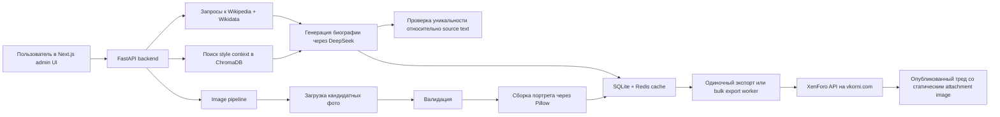

# Vkorni

Генерация биографий с помощью AI, подготовка мемориальных изображений и публикация на `vkorni.com`.

Языки:
- English: [README.md](README.md)
- Русский: `README.ru.md`
- Гайд по деплою: [README.dep](README.dep)

## Обзор

Vkorni это full-stack приложение, которое принимает имя человека, собирает фактический контекст из Wikipedia и Wikidata, генерирует литературную биографию через DeepSeek, подбирает и обрабатывает изображения, делает мемориальный портрет и публикует результат на `vkorni.com` через XenForo API.

Приложение поддерживает пакетную генерацию и устойчивый bulk export. Сгенерированные тексты кешируются, изображения хранятся локально, стиль подтягивается через небольшой RAG-слой на ChromaDB, а фоновые задачи выполняются через Redis + RQ.

## Что Делает Система

- Генерирует биографии на основе контекста из Wikipedia.
- Использует небольшой style-RAG слой на базе ChromaDB для выбора примеров стиля.
- Проверяет текст на слишком близкое сходство с исходным материалом.
- Загружает фотографии, валидирует их, отбрасывает слабые и собирает оформленные портреты.
- Публикует итоговый материал на `vkorni.com` через XenForo API.
- Поддерживает массовую отправку и self-healing bulk export с retry и resume логикой.

## Визуальная Схема



## Как Это Работает

### 1. Сбор данных

Backend получает информацию о человеке из Wikipedia и Wikidata, собирает факты, даты и доступные изображения и превращает их в единый контекст для генерации.

### 2. Маленький RAG на ChromaDB

Приложение использует ChromaDB как легкий слой извлечения стиля. Если пользователь указывает стиль, backend сначала ищет точное совпадение, а если его нет, берет ближайшие документы из ChromaDB и добавляет их в prompt.

### 3. Генерация биографии

DeepSeek получает:
- фактический контекст о человеке
- стиль из ChromaDB
- внутренний narrative angle template

После этого модель возвращает литературную биографию, которая очищается и проверяется на схожесть с исходным текстом.

### 4. Обработка изображений

Image pipeline:
- загружает исходные фото
- валидирует их
- переносит слабые фото в rejected
- собирает мемориальный портрет с оформлением и датами
- сохраняет accepted и rejected assets в разные директории

### 5. Публикация

Экспорт на `vkorni.com` сначала загружает статический attachment через XenForo, а потом создает thread. В сообщение вставляется URL XenForo attachment, а не backend `/api` URL.

### 6. Массовый экспорт

Bulk export теперь выполняется по одному профилю на задачу, а не одним длинным job. У каждой позиции есть собственный статус, счетчик попыток и путь для автоматического восстановления. Зависшие позиции watchdog может поставить в работу заново.

## Основные Компоненты

| Слой | Технология |
|---|---|
| Frontend | Next.js 15, React 19, Tailwind CSS |
| Backend | FastAPI, Python 3.11 |
| Генерация текста | DeepSeek API |
| Очередь | Redis + RQ |
| Извлечение стиля | ChromaDB |
| Реляционное хранение | SQLite + SQLAlchemy |
| Сборка изображений | Pillow |
| Контейнеризация | Docker Compose |

## Структура Репозитория

```text
vkorni/
├── backend/
│   ├── app/api/          # FastAPI endpoints
│   ├── app/services/     # generation, export, image, style, cache logic
│   ├── app/workers/      # RQ workers
│   ├── app/db/           # SQLite, Redis, Chroma access layers
│   ├── frames/           # frame templates and fonts
│   └── Dockerfile
├── frontend/
│   ├── app/              # Next.js routes
│   ├── components/       # UI components
│   ├── hooks/            # client-side state and polling logic
│   └── Dockerfile
├── docker-compose.yml
├── docker-compose.prod.yml
├── README.dep
└── README.md
```

## Локальный Запуск

### Требования

- Docker Desktop

### Окружение

Скопируй `.env.example` в `.env` и заполни обязательные значения.

Ключевые переменные:
- `DEEPSEEK_KEY`
- `VKORNI_BASE_URL`
- `VKORNI_API_KEY`
- `VKORNI_NODE_ID`
- `VKORNI_USER_ID`
- `BACKEND_PUBLIC_URL`
- `NEXT_PUBLIC_API_BASE`
- `JWT_SECRET`

### Запуск через Docker

```bash
docker compose up -d --build
```

Если нужно больше worker-процессов:

```bash
docker compose up -d --build --scale worker=2
```

Локальные адреса по умолчанию:

| Сервис | URL |
|---|---|
| Frontend | `http://localhost:3014` |
| Backend API | `http://localhost:8020` |
| Swagger docs | `http://localhost:8020/docs` |

## Продакшен

Текущий production pipeline:

1. Push в `main`
2. GitHub Actions собирает backend и frontend Docker images
3. Images отправляются в GHCR
4. Сервер в `/opt/vkorni` подтягивает новые images
5. `docker compose -f docker-compose.prod.yml up -d` перезапускает сервисы

Подробный и безопасный сценарий деплоя описан в [README.dep](README.dep).

## API Кратко

| Method | Endpoint | Назначение |
|---|---|---|
| `POST` | `/api/generate?name=...` | Генерация одной биографии |
| `GET` | `/api/cache` | Список кешированных биографий |
| `GET` | `/api/cache/{name}` | Загрузка одной биографии |
| `POST` | `/api/export` | Экспорт одного профиля на `vkorni.com` |
| `POST` | `/api/bulk-export` | Старт массового экспорта |
| `GET` | `/api/bulk-export/{id}` | Статус bulk export |
| `POST` | `/api/frame` | Превью мемориальной рамки |
| `POST` | `/api/image-job` | Запуск обработки изображений |
| `POST` | `/api/admin/login` | Аутентификация администратора |

## Примечания

- Runtime data хранятся в Docker volumes, а не в git.
- Приложение отдельно хранит SQLite, ChromaDB, accepted images, rejected images и raw photos.
- Bulk export стал устойчивее, но внешняя доступность `vkorni.com`, Redis и самого сервера все равно важна.
- Сейчас production использует mutable tag `latest`. Это работает, но versioned tags сделали бы rollback безопаснее.
